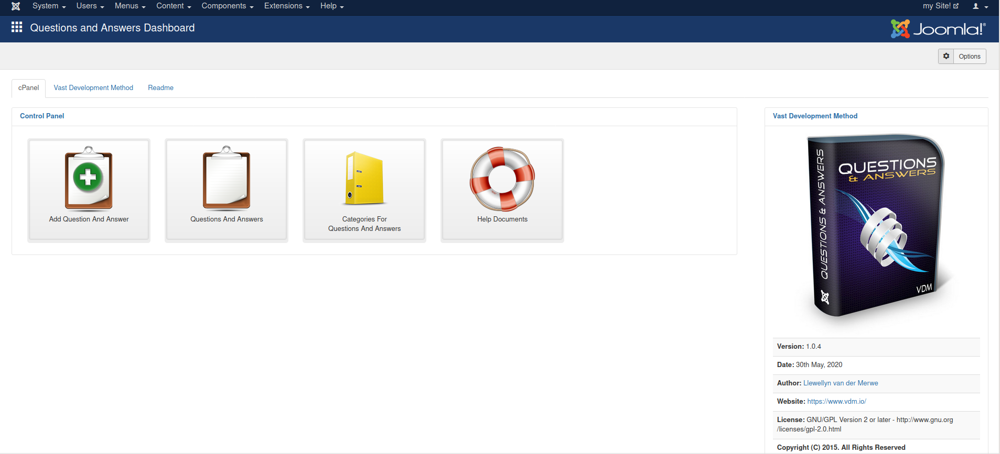
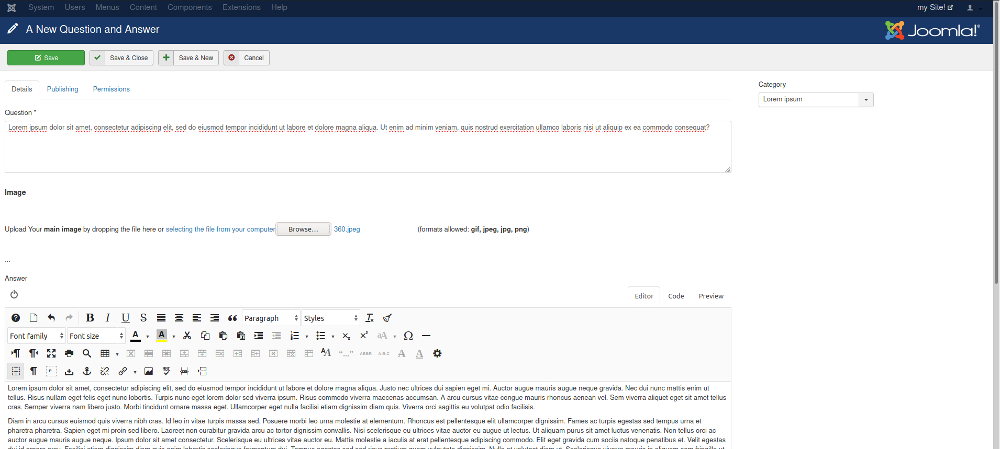
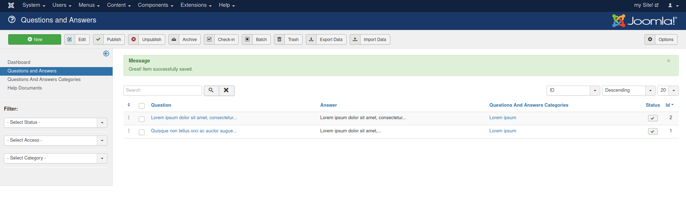
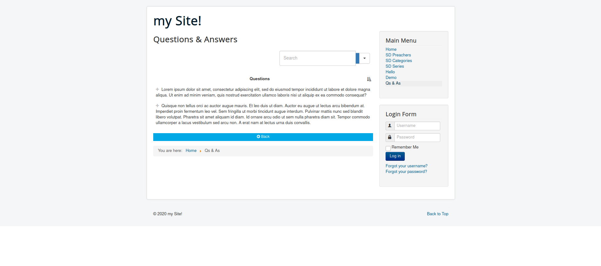
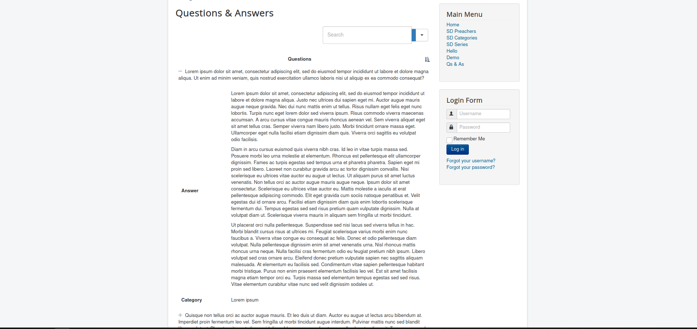
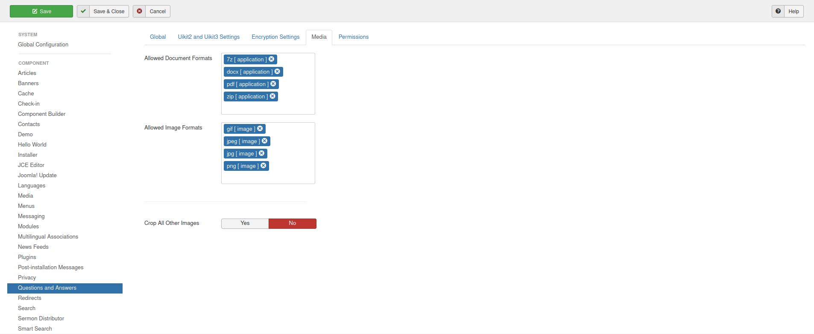

# <u>Adding *Questions & Answers*:</u>

### Step One: After you have finished installing the Questions & Answers component, Goto Toolbar->Components and then select the Questions & Answers component from the list of all available components. Click on the *Add Questions & Answers* button.

### Step Two: Fill in the <u>question</u> and the <u>answer</u>

### Step Three:

### Step Four:

### Step Five:

### Step Six:

